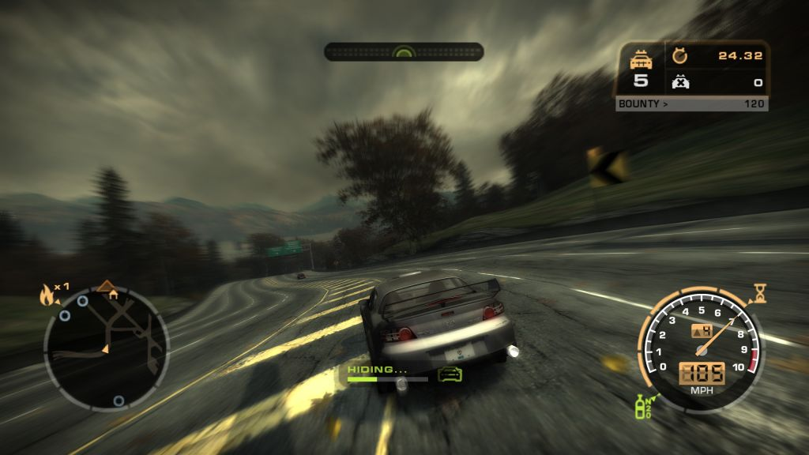
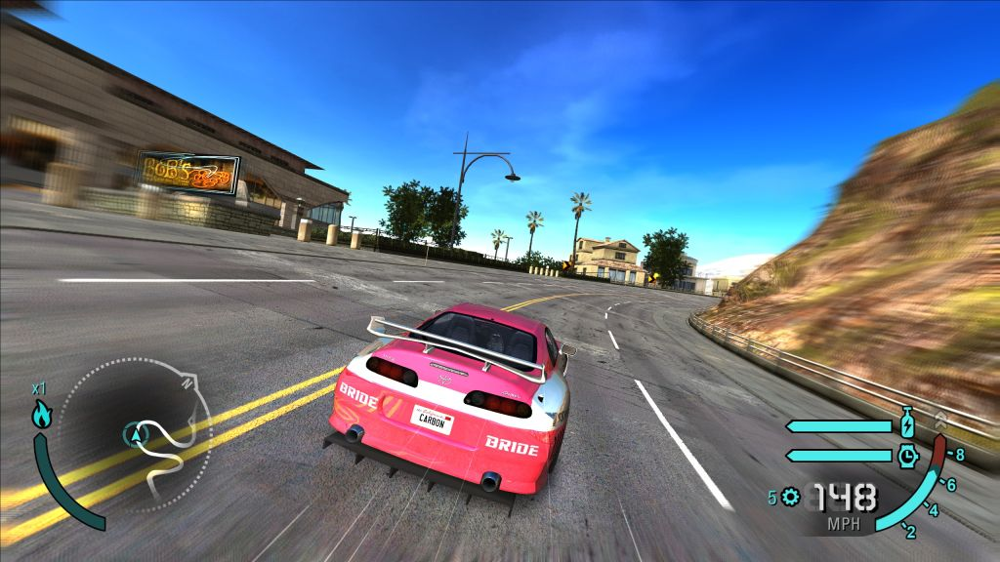

# NFS MW and Carbon Camera Mods

### Initially designed to improve camera experience.

### Features: 
- UG2 style camera for MW & CB
- Cinematic camera for CB

 

## Some details about how camera works in MW & CB 

In **Need for Speed: Most Wanted (2005)** the camera system is **multi-stage**, and depending on where you hook, it *looks* like two passes per frame.

Here’s the precise breakdown.

---

## What actually happens per frame in MW

### 1️⃣ **Simulation / Director pass (authoritative)**

This happens during the **simulation update**:

* Camera director logic runs (follow cam, drift cam, cinematic blends)
* Car state is fresh (physics just updated)
* Look-at matrices are built for *intent*
* This is where:

    * yaw rate
    * velocity direction
    * roll intent
      **should be sampled**

Your hook trigger:

```cpp
hkCubicUpdate → gApplyUG2Flag = 1
```

is correctly marking **this pass**.

---

### 2️⃣ **Render / polish pass**

Later in the same frame (sometimes multiple times):

* Camera matrix is rebuilt or touched again
* Used for:

    * motion blur
    * mirrors
    * reflections
    * post effects
    * UI overlays
* Physics is **not updated**
* Director may not run

This pass:

* must **NOT** drive camera dynamics
* must **NOT** integrate roll/yaw again
* must only **consume already-computed camera state**

---

## Why it *feels* like “two passes”

Because:

* `CreateLookAt` (or equivalent) **can be called more than once per frame**
* But **only one of those calls is authoritative**

So if you:

* integrate roll/yaw on *every* call → jitter, edgy feel
* integrate only on flagged call → smooth (UG2 behavior)

You already discovered this empirically with `gApplyUG2Flag`.

---

## Correct mental model (this is key)

Think of MW camera like this:

```
[ Sim Update ]
   └─ Director computes camera intent
      └─ (you sample & integrate dynamics here)

[ Render Pass ]
   ├─ Rebuild view matrix
   ├─ Rebuild view matrix again (mirrors / blur)
   └─ Use same camera state
```

So:

* **State update = once per frame**
* **Matrix application = many times per frame**

---

## Why UG2 feels smoother

UG2 explicitly separates:

* **camera state integration** (once per frame)
* **view matrix emission** (many times)

MW does the same implicitly — you just have to respect it when hooking.

Your current structure is now correct because:

```cpp
bool applyRoll = (InterlockedExchange(&gApplyUG2Flag, 0) != 0);

// state update → always
// roll application → only if applyRoll
```
That is **exactly** what MW expects.


## Why this matters for your “edgy” issue

If you accidentally:

* integrate yaw/roll on non-authoritative passes
* or reset state when `applyRoll == false`

you get:

* micro spikes
* jitter
* snapping on transitions

**90%** fixed of this by:

* decoupling state update vs application
* adding hard-cut detection
* smoothing rollTarget

---

## Final takeaway

- MW **does not** do two full camera updates per frame
- It **does** emit the camera matrix multiple times
- Only **one pass per frame** should drive dynamics
- Your `gApplyUG2Flag` approach is correct
- Remaining “edginess” is *signal shaping*, not engine behavior

